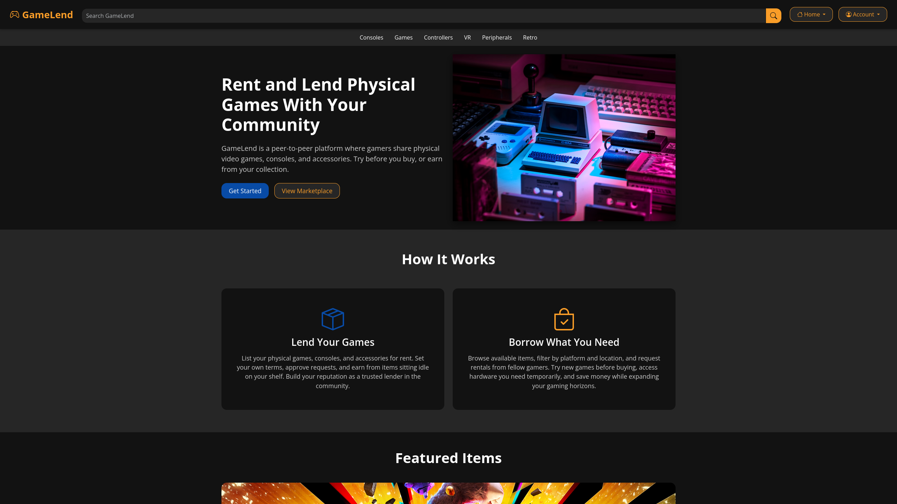

# GameLend

GameLend is a peer-to-peer web application for renting and lending physical video games, consoles, and gaming accessories. It connects gamers who have idle items with borrowers who want short-term access instead of buying new hardware or titles.

## Features

- User registration and login with role-based access (borrower, lender, admin)
- Catalog of rentable items with search and filtering by platform, type, and availability
- Item detail pages with condition, rental terms, and owner information
- Lender dashboard for managing listings and responding to rental requests
- Borrower dashboard for tracking active rentals and rental history
- Admin portal for moderating users, listings, and the game catalog

## Tech Stack

- HTML, CSS, JavaScript (frontend)
- Bootstrap 5 and Bootstrap Icons for layout and styling
- Node.js with Express.js (backend, planned)
- MySQL (relational database, planned)

## Team

- Tyler Weddle ([tyler-weddle](https://github.com/tyler-weddle))
- Jonahtan Vasquez ([JonahtanV](https://github.com/JonahtanV))
- Alex Carbajal ([alex-sir](https://github.com/alex-sir))
